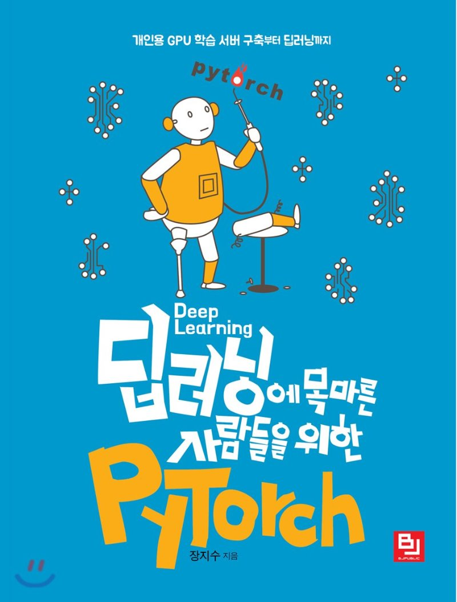

# 딥러닝에 목마른 사람들을 위한 PyTorch



"딥러닝에 목마른 사람들을 위한 PyTorch" 학습 GitHub 입니다.

## 학습을 시작하는 방법

해당 레포지토리를 클론하시고, 각자 자신이 설정한 가상환경을 활성화 시킨 후에 시작하세요! :)

```
$ git clone https://github.com/simonjisu/pytorch-book
```

## 필요 패키지

```
pytorch >= 1.0.0
torchvision >= 0.2.0
numpy
matplotlib
```

